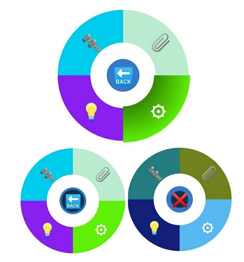

# Welcome to the AR-action App

AR-action is a proof-of-concept for hands free menu navigation with augmented reality (AR) glasses.

We developed a general concept that can be substantiated for specific use cases (i.e. controlling industrial machines or medical patient visits)

## Concept

For prototyping a development kit of the *tooz* AR glasses was used (<https://tooz.com/>).

### Menu concepts

#### Radial Menu

The radial menu was inspired by video games and allows users to control the menu with minimal head movement.

Deep menu structures can be created with this but it can only show a limited number of options at once. It also requires knowledge of the menu structure and it can take some time to navigate into deeper levels of the structure.

The user is informed about the currently hovered button through this button getting bigger and a slowly filling gradient. Is the button completely filled, this button is selected.

#### Tile Menu

The tile menu allows for a broad overview of available options and is structured in two dimensions. Because of this the menu structure is relatively flat but broad.

Depending on how broad the menu structure is, head movements can also become larger and therefore might be uncomfortable for the user.

There is also a version that locks a user into a column, if they leave the first row. This can be beneficial to avoid accidental selections but can also be quite unnatural for the user.

The user is informed about the currently hovered button through this button slowly filling with a gradient. Is the button completely filled, this button is selected.

### Input methods

The following options for user input were considered:

- voice recognition
- eye tracking
- movement tracking (of the users head)

Ultimately we decided on tracking the users head movement using the built in inertial measurement unit (IMU) of the glasses.

We use the rotation of the users head to calculate a line of sight which can then be used to trigger menu options by facing them.

#### Head tracking calculations

The application receives the relevant IMU sensor data fused into an euler rotation vector (<https://developer.android.com/develop/sensors-and-location/sensors/sensors_position>).

This vector is then transformed into a rotation matrix for further calculations.

When the TrackingEventManager is started, an initial vector is saved as a reference point, which encodes what way the user faces in that moment.

After that, each time new rotation data is received from the IMU it is compared to the initial vector.

From this comparison of the initial view direction and the current view direction, a difference vector is derived. With this difference vector the following is calculated:

- the length of the difference vector as the distance (**d**)
- the angle (**α**) between the difference vector and the z axis vector (the vector opposed to the direction of gravity)

The two values **d** and **α** are then sent to the externally provided callback function and from there can be used for menu operations.

#### Phone tracking

> [!WARNING]
> When both frequently sending IMU tracking data and also frequentliy receiving frame data the utilized *tooz* AR glasses crash.

Due to this reliability limit of the glasses we decided to use the IMU of the connected smarphone as a drop-in replacement. The calculation stays the same but instead of controlling the application with head movements, users use the smartphone as a wand (like a laser pointer or a Wii-mote).

## Architecture

#### tooz software architecture

The araction-app is a so called *toozer* and communicates with the *tooz Control App* through Inter Process Communication (IPC) by using a library provided by *tooz*.

#### araction software architecture

The araction app consists of multiple packages that each comprise a certain feature.

The radial and tile menu packages contain everything that is needed for displaying those menus. They expose methods to move their view and can therefore be controlled using an arbitrary input method.

The phone and IMU tracking packages each provide a different input method and expose an event bus that can be provided with a callback for each event of the TrackingEventManager interface.  
The phone_tracking package lets the user use their phone like a laser pointer.  
The tooz_IMU_tracking package provides a way to track the head movement of the user.

The araction app also includes multiple examples, that were used to experiment with the *tooz* AR glasses. These are not meant to be reused and are therefore not documented here.

##### Radial menu package

The radial menu package includes the components of the menu, as well as the BaseToozifierFragment and BaseToozifierLayout (see [here](#Base-fragment-and-layout)).

The radial menu consists of four components.  
The RadialMenuButton is the parent class for the two button types and provides the handling for the hover state of the button and how actions are taken.  
The MainButton is the center button, while a RadialButton is one of the buttons around the circle.  
The RadialMenu is the manager of these buttons and how they are created.

When creating the radial menu, RadialMenuData needs to be provided. This consists of a main button and an array of the abstract RadialButtonData. RadialButtonData needs the label of the button and its color and is extended by three classes:

- The RadialActionButtonData includes a callback, so that an action can be taken, if the button is triggered.
- The RadialSubmenuButtonData includes a submenu of RadialMenuData, which is the menu, that is displayed if this button is triggered.
- The RadialBackButtonData creates a back button, that move the menu up one layer if triggered.

##### Tile menu package

The tile menu package includes the two provided menus, the components they are based around, as well as the BaseToozifierFragment and BaseToozifierLayout (see [here](#Base-fragment-and-layout)).

The TileMenu is a grid of tiles that can be freely moved around.  
The TileLockedMenu looks the same but if the user moves down into a column, their movement is locked to that column until either an action is taken or they move back to top row.

The TileLockedMenu extends the TileMenu and only overrides how the view is moved, to achieve the described effect.

Both menus are only two dimensional. If a submenu is opened, the new tiles are laid out to the right of the triggered button, while all other tiles, except the trigggered button are deleted from the view.

The menu is created with an Array of the abstract TileButtonData, which has a label and color. It is extended by TileActionButtonData and TileSubmenuButtonData. TileActionButtonData additionaly has a callback function, while TileSubmenuButtonData has an array of further TileButtonData.

##### Base fragment and layout

These provide base behavior that can be overriden.

The BaseToozifierLayout controls sending the view to the *tooz* AR glasses, by starting a loop where it constantly sends a new frame to the *tooz* AR glasses and then waits for a preset delay.

The BaseToozifierFragment controls registering with the *tooz* AR glasses, interacting with the tracking package and how the view is shown on the phone screen.

Both should be extended with menu specific classes, where the following methods should be overriden:

- onCreateView, where a binding to the menu should be set and its root returned
- onViewCreated, where
  - the layout should be inflated
  - the menu in the binding and layout should be populated
  - TrackingEventManager should be initialized
- onDestroyView, where the hover jobs of both menus in the binding and layout should be stopped

##### tracking packages

The TrackingEventManager class (tooz_imu_tracking or phone_tracking) provides a SensorDataCallback interface which needs to be implemented when instantiating the class. A SensorDataCallback consists of two callback methods, one for handling a tracking update and one to notify about an update of the sensor accuracy.  
  
The TrackingEventManager then calls the appropriate callback every time it receives a new sensor data event and thus provides the necessary values to use in menu operations (see [Head tracking calculations](#head-tracking-calculations)).

## Who maintains and contributes to the project

The project was created in scope of the profile project "Applied computer science research" (INF-PM-FPA) at the chair of software technology, faculty of computer science, Dresden University of Technology.

This repository is currently not actively being maintained by the authors.

## Attributions

| Content                   | Source                                                                      |
|---------------------------|-----------------------------------------------------------------------------|
| *tooz* architecture picture | <https://gitlab.com/toozout/bto-sdk/doc-toozifier/-/blob/master/guidebook.md> |
|                           |                                                                             |
